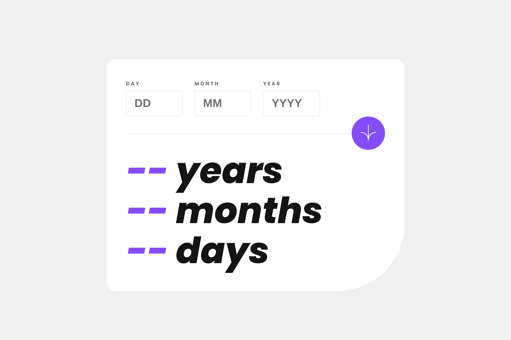

# Frontend Mentor - Age calculator app solution

This is a solution to the [Age calculator app challenge on Frontend Mentor](https://www.frontendmentor.io/challenges/age-calculator-app-dF9DFFpj-Q). Frontend Mentor challenges help you improve your coding skills by building realistic projects. 

## Table of contents

- [Overview](#overview)
  - [The challenge](#the-challenge)
  - [Screenshot](#screenshot)
  - [Links](#links)
- [My process](#my-process)
  - [Built with](#built-with)
  - [What I learned](#what-i-learned)
- [Author](#author)

## Overview
This project is designed to make calculating time that has past after an event easier and more comprehensible.

### The challenge

Users should be able to:

- View an age in years, months, and days after submitting a valid date through the form
- Receive validation errors if:
  - Any field is empty when the form is submitted
  - The day number is not between 1-31
  - The month number is not between 1-12
  - The year is in the future
  - The date is invalid e.g. 31/04/1991 (there are 30 days in April)
- View the optimal layout for the interface depending on their device's screen size
- See hover and focus states for all interactive elements on the page
- **Bonus**: See the age numbers animate to their final number when the form is submitted

### Screenshot

### Links

- Solution URL: [solution URL](https://your-solution-url.com)
- Live Site URL: [live site](https://your-live-site-url.com)

## My process
Looking at the [desktop](design/desktop-design.jpg) and the [mobile design](design/mobile-design.jpg)
- Knew the design are very similar and needed only few changes.
- I positioned the button `absolute`ly for easier transitioning across display
- I give the form a `border-bottom` for the grayish line below the inputs in the [screenshot](#screenshot).
- I have to do some extended research on the Javascript side, but can't find something that suite my liking, gained some knowledge in the process though. I leave my own stuff there.

### Built with

- Semantic HTML5 markup
- CSS custom properties
- Flexbox
- Mobile-first workflow

### What I learned
Just realised separate fonts is recommended for different font style too 😀.

## Author

- Website - [Abdullah Muslim](https://abdullahmuslim.github.io/portfolio)
- Frontend Mentor - [@abdullahmuslim](https://www.frontendmentor.io/profile/abdullahmuslim)